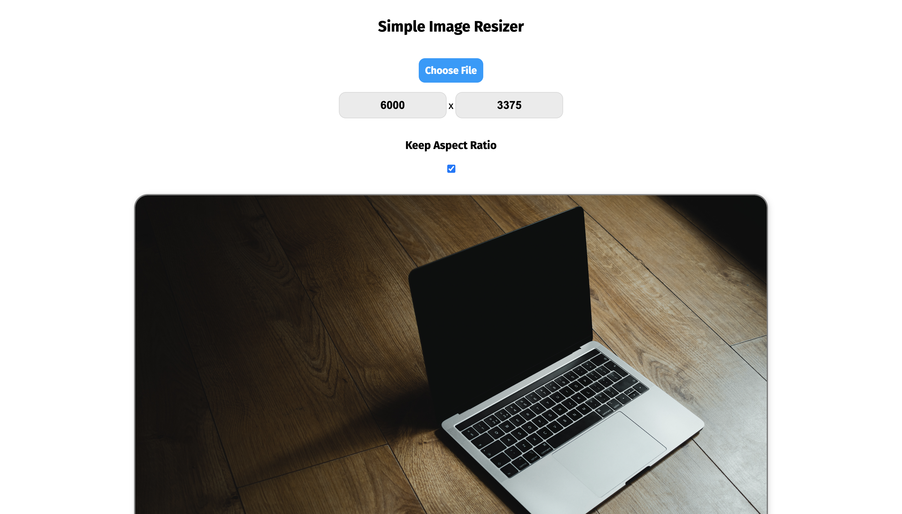

<!-- PROJECT LOGO -->
 

  <h2 align="center">Simple Image Resizer</h3>
    
  

    View Project Demo
     
    <a href="https://demo-image-resizer-app.williamhmoody.com">View Demo</a>
  

<!-- TABLE OF CONTENTS -->

  
Table of Contents

  <ol>
    <li>
      <a href="#about-the-project">About The Project</a>
      <ul>
        <li><a href="#built-with">Built With</a></li>
      </ul>
    </li>
    <li><a href="#license">License</a></li>
  </ol>

<!-- ABOUT THE PROJECT -->
## About The Project
This simple application uses HTML5 Canvas api to load images files into a document, where they can later be resized.

### Built With

* HTML
* HTML5 Canvas API                                                         
* CSS
* JavaScript

(<a href="#readme-top">back to top</a>)

<!-- LICENSE -->
## License

Distributed under the MIT License.

(<a href="#readme-top">back to top</a>)

